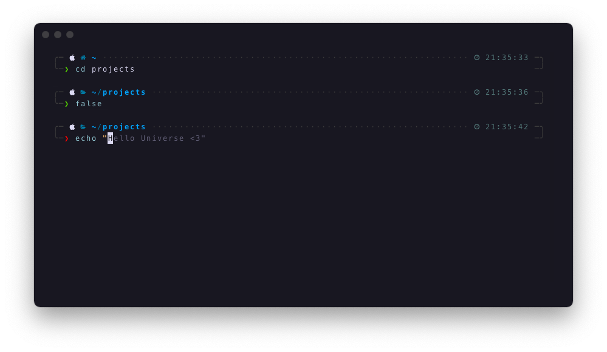

# 💻 Kevin Wolf's Dotfiles

## What is this?

A set of shell scripts used to setup a new OSX system using opinionated tools and conventions.

## Pre-requisites

This setup uses [Oh My ZSH](https://ohmyz.sh) with the [Powerlevel10k](https://github.com/romkatv/powerlevel10k#meslo-nerd-font-patched-for-powerlevel10k) theme. So make sure to configure your terminal to use the [Meslo Nerd Font](https://github.com/romkatv/powerlevel10k#meslo-nerd-font-patched-for-powerlevel10k).

## Usage

1. Clone this repo: `git clone --recursive https://github.com/elkevinwolf/dotfiles`
2. Run the setup script: `sh install.sh`
3. Enjoy your new setup! 🍻

## What's included

### Binaries

The following binaries will be installed and made available for immediate use:

- [`brew`](https://brew.sh/index_es)
- [`bun`](https://bun.sh)
- [`gh`](https://cli.github.com)
- [`jq`](https://stedolan.github.io/jq)
- [`tree`](http://mama.indstate.edu/users/ice/tree)

### Apps

Additionally, if running on OSX, the following apps will be installed:

- [1Password](https://1password.com)
- [Arc](https://arc.net)
- [Bartender](https://macbartender.com)
- [Cursor](https://cursor.com)
- [Discord](https://discord.com)
- [Docker](https://docker.com)
- [Ghostty](https://ghostty.org)
- [Raycast](https://raycast.com)
- [Spark](https://sparkmailapp.com)
- [WhatsApp](https://whatsapp.com)

### Oh my ZSH

Oh my ZSH will be downloaded and installed with the following configuration:

#### Theme

- [Powerlevel10k](https://github.com/romkatv/powerlevel10k#meslo-nerd-font-patched-for-powerlevel10k)

#### Plugins

- [`git`](https://github.com/ohmyzsh/ohmyzsh/tree/master/plugins/git)
- [`zsh-autosuggestions`](https://github.com/zsh-users/zsh-autosuggestions.git)
- [`zsh-completions`](https://github.com/zsh-users/zsh-completions.git)
- [`zsh-syntax-highlighting`](https://github.com/zsh-users/zsh-syntax-highlighting.git)

#### Aliases

##### From plugins

- [`git` plugin aliases](https://github.com/ohmyzsh/ohmyzsh/tree/master/plugins/git#aliases)

##### General

| alias    | description                                                             | usage             |
| -------- | ----------------------------------------------------------------------- | ----------------- |
| `reload` | reload the terminal (useful when changing terminal init configurations) | `reload`          |
| `mcd`    | create a directory and `cd` into it                                     | `mcd my-dir-name` |
| `dev`    | change to developer directory (`~/Developer`)                           | `dev`            |

#### Git

| alias   | description                                               | usage                      |
| ------- | --------------------------------------------------------- | -------------------------- |
| `gpb`   | checkout previous active branch                           | `gpb`                      |
| `gac`   | stage all files and commit with a message                 | `gac "my commit message"`  |
| `gacp`  | stage all files, commit with a message and push           | `gacp "my commit message"` |
| `gac!`  | stage all files and overwrite previous commit             | `gac!`                     |
| `gacp!` | stage all files, overwrite previous commit and force-push | `gacp!`                    |
